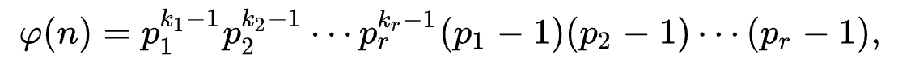
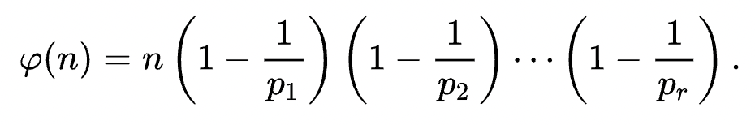

## 欧拉函数（数论）

#### 定义

欧拉函数，$\varphi(n)$，表示小于等于 $n$ 且与 $n$ 互质的数的个数。

#### 欧拉函数的值



等价形式



代码实现：

```cpp
int euler_phi(int n) {
  int ans = n;
  for (int i = 2; i * i <= n; i++)
    if (n % i == 0) {
      ans = ans / i * (i - 1);
      while (n % i == 0) n /= i;
    }
  if (n > 1) ans = ans / n * (n - 1);
  return ans;
}
```

#### 性质

1. 若 n 为质数，则 $\varphi(n) = n - 1$。

2. 欧拉函数是[积性函数](https://zh.wikipedia.org/wiki/積性函數)。若 $\gcd(a, b) = 1$，则 $\varphi(a \times b) = \varphi(a) \times \varphi(b)$。

3. $n = \sum_{d \mid n}{\varphi(d)}$。（$d | n$ 表示 n 能被 d 整除）
4. 若 $n = p^k$， $p$ 为质数，则 $\varphi(n) = p^k - p^{k - 1}$。
5. 欧拉定理：若 $\gcd(a, m) = 1$，则 $a^{\varphi(m)} \equiv 1 \pmod{m}$。
6. 拓展欧拉定理：
$$
a^b\equiv
\begin{cases}
a^{b\bmod\varphi(p)},\,&\gcd(a,\,p)=1\\
a^b,&\gcd(a,\,p)\ne1,\,b<\varphi(p)\\
a^{b\bmod\varphi(p)+\varphi(p)},&\gcd(a,\,p)\ne1,\,b\ge\varphi(p)
\end{cases}
\pmod p
$$

7. 费马小定理：
若 $p$ 为素数，$\gcd(a, p) = 1$，则 $a^{p - 1} \equiv 1 \pmod{p}$。
另一个形式：对于任意整数 $a$，有 $a^p \equiv a \pmod{p}$。